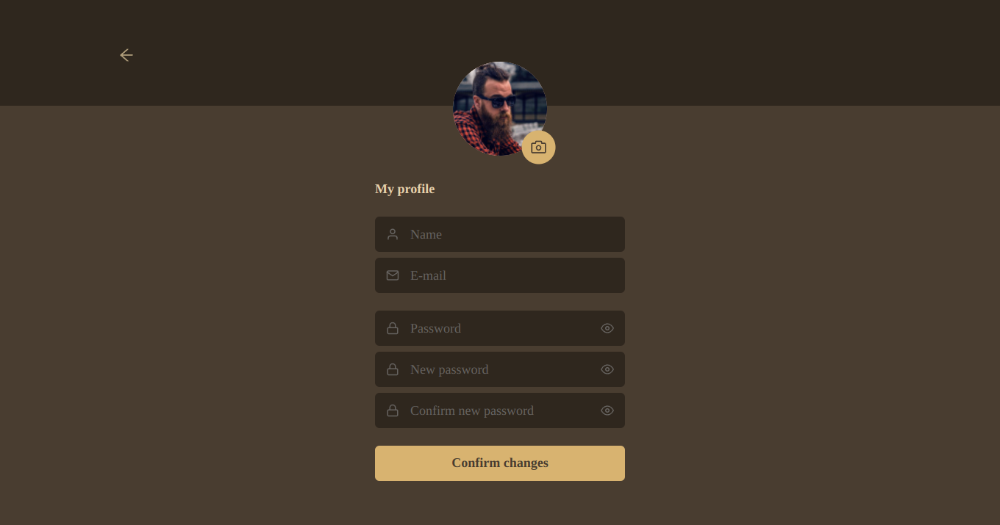
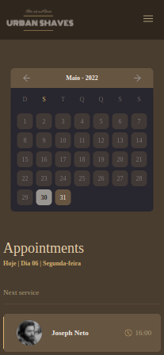
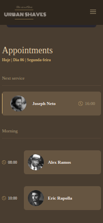

<div align="center">

  

  

  


</div>

## **💻 Projeto**

O projeto <strong>Urban Shaves</strong> foi desenvolvido em [React](https://reactjs.org/) utilizando o [Chakra UI](https://chakra-ui.com/guides/first-steps).

## **🔖 Layout**

<p>Foi criado o nome e a logo <strong>Urban Shaves</strong>, utilizamos a seguinte tabela de cores:
</p>

  
<br/>
  
Foi necessário o uso do [GIMP](https://www.gimp.org/ ) para tratar as imagens e aplicar alguns filtros com base na paleta de cores. Criamos próprio calendário pois foi achamos mais fácil criar outro ao invés de adaptar algum ao projeto.
  
####  **Web**
  
  <div>
    
    <br/>
    <br/>
    
    <br/>
    <br/>
    
    <br/>
    <br/>
    
  <div>
  
####  **Mobile**
  
<p align="center">
  
  
  
</p>
<p align="center">
  
  
</p>
  
##  Get Started
  
  
```bash
# Instalação das dependências
$ yarn
  
# Start
$ yarn dev
```
  
##  Observação

O projeto encontra-se em desenvolvimento juntamente com uma API desenvolvida em Nest.

## **👨‍🚀 Autor**

<a href="https://github.com/tpaphysics">

  <br />
  <sub>
    <b>Thiago Pacheco de Andrade</b>
  </sub>
</a>
<br />
  
👋 Meus contatos!
  
[](https://www.linkedin.com/in/thiago-pacheco-200a1a86/)
[](mailto:physics.posgrad.@gmail.com)
  
##   Licença
  
  
  
Veja o arquivo [MIT license](LICENSE ).
